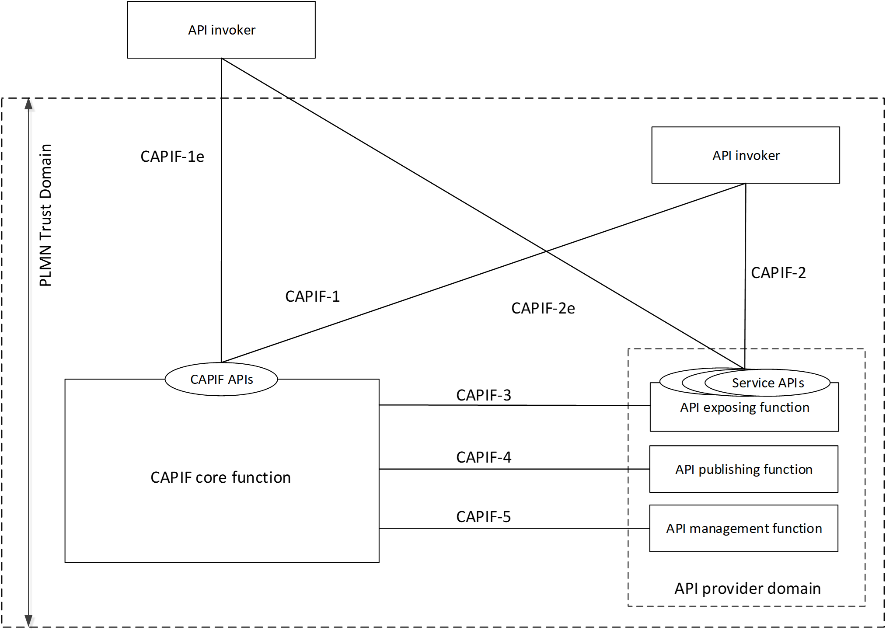
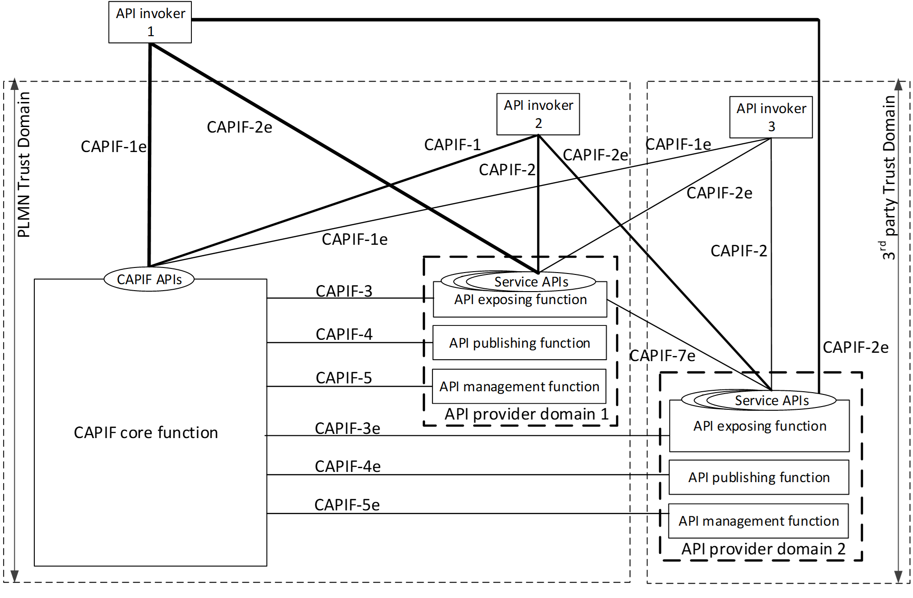
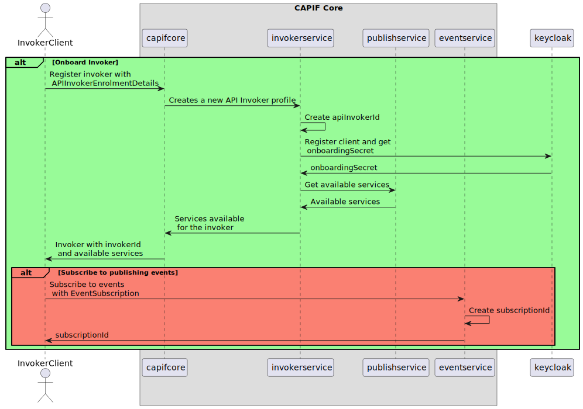

.. This work is licensed under a Creative Commons Attribution 4.0 International License.
.. SPDX-License-Identifier: CC-BY-4.0
.. Copyright (C) 2023 Nordix
.. Copyright (C) 2024 OpenInfra Foundation Europe. All rights reserved.

#############
Overview
#############

Service Management and Exposure has 2 components - CAPIF Core and Service Manager. Capifcore is found in the "capifcore" directory,
and Service Manager is in the "servicemanager" directory.

This product is a part of :doc:`NONRTRIC <nonrtric:index>`.

*************
CAPIF
*************

Introduction
************

CAPIF stands for Common API framework and it was developed by 3GPP to enable a unified Northbound API framework across 3GPP network functions, and to ensure that there is a single and harmonized approach for API development.

Key features in capif includes onboarding and offloading of application functions, service discovery and management, event subscription and notification as well as authorization and authentication.

It was delivered in Rel-15 (Refer to 3GPP TS 23.222 and 3GPP TS 29.222)

Functional entities
===================

The CAPIF consists of an API provider functions, the CAPIF core functions and API Invoker.

CAPIF Core function
~~~~~~~~~~~~~~~~~~~

The CAPIF core functions support the API invokers to access the service APIs. It consists of the following capabilities:

* Authenticating the API invoker based on the identity and other information required for authentication of the API invoker;
* Supporting mutual authentication with the API invoker;
* Providing authorization for the API invoker prior to accessing the service API;
* Publishing, storing and supporting the discovery of service APIs information;
* Monitoring the service API invocations;
* Onboarding a new API invoker and offboarding an API invoker;
* Supports publishing, discovery of service APIs information with another CAPIF core function in CAPIF interconnection.

API Invoker
~~~~~~~~~~~

The API invoker is the entity which invokes the CAPIF or service APIs, typically provided by a 3rd party application provider who has service agreement with PLMN operator.

The API invoker supports the following capabilities:

* Triggering API invoker onboarding/offboarding;
* Supporting the authentication by providing the API invoker identity and other information required for authentication of the API invoker;
* Supporting mutual authentication with CAPIF;
* Obtaining the authorization prior to accessing the service API;
* Discovering service APIs information; and
* Invoking the service APIs.

API Provider functions
~~~~~~~~~~~~~~~~~~~~~~

The API provider functions consists of:

* **API exposing function** is the provider of the service APIs and is also the service communication entry point of the service API to the API invokers. Provides access control, logging, charging, provides authentication and authorization support.
* **API publishing function** is responsible for the capability to publish the service API information of the API provider to the CAPIF core functions in order to enable the discovery of APIs by the API invoker.
* **API management function** is the entity which registers and maintains registration information of the API provider domain functions on the CAPIF core function.

CAPIF core function APIs
************************

* **CAPIF_Discover_Service_API** API: This API enables the API invoker to communicate with the CAPIF core function to discover the published service API information.
* **CAPIF_Publish_Service_API** API:This API enables the API publishing function to communicate with the CAPIF core function to publish the service API information and manage the published service API information.
* **CAPIF_Events** API: This API enables the API subscribing entity to communicate with the CAPIF core function to subscribe to and unsubscribe from CAPIF events and receive subsequent notification of CAPIF events. This API is used for the subscription to and notifications of those CAPIF events that are not bound to any of the other CAPIF core function APIs.
* **CAPIF_API_invoker_management** API: This API enables the API invoker to communicate with the CAPIF core function to enroll as a registered user of CAPIF and manage the enrollment information.
* **CAPIF_Security** API:This API enables the API invoker to communicate with the CAPIF core function to authenticate and obtain authorization to access service APIs.
* **CAPIF_Monitoring** API: This API enables the API management function to communicate with the CAPIF core function to subscribe to and unsubscribe from CAPIF events related to monitoring and receive subsequent notification of CAPIF monitoring events.
* **CAPIF_Logging_API_Invocation** API: This API enables the API exposing function to communicate with the CAPIF core function to log the information related to service API invocation.
* **CAPIF_Auditing** API: This API enables the API management function to communicate with the CAPIF core function to retrieve the log information related to service API invocation.
* **CAPIF_Access_Control_Policy** API: This API enables the API exposing function to obtain the policy to perform access control on the service API invocations.
* **CAPIF_Routing_Info** API: This API enables the API exposing function to obtain the routing information to forward the API invocation to another API exposing function.
* **CAPIF_API_provider_management** API: This API enables the API Management Function to communicate with the CAPIF core function to register the API provider domain functions as authorized users of the CAPIF functionalities.

The table below lists the CAPIF Core Function APIs.

+-----------------------------------+------------------------------+----------------------------------------------+----------------------------------------------------------------------------------------+
|     **Service Name**              | **Service Operations**       | **Operation Semantics**                      | **Consumer(s)**                                                                        |
+-----------------------------------+------------------------------+----------------------------------------------+----------------------------------------------------------------------------------------+
| CAPIF_Discover_Service_API        | Discover_Service_API         | GET /allServiceAPIs                          | API Invoker, CAPIF core function                                                       |
+-----------------------------------+------------------------------+----------------------------------------------+----------------------------------------------------------------------------------------+
| CAPIF_Publish_Service_API         | Publish_Service_API          | POST /{apfId}/service-apis                   | API Publishing Function, CAPIF core function                                           |
+                                   +------------------------------+----------------------------------------------+----------------------------------------------------------------------------------------+
|                                   | Unpublish_Service_API        | DELETE /{apfId/service-apis/{serviceApiId}   | API Publishing Function, CAPIF core function                                           |
+                                   +------------------------------+----------------------------------------------+----------------------------------------------------------------------------------------+
|                                   | Update_Service_API           | PUT /{apfId/service-apis/{serviceApiId}      | API Publishing Function, CAPIF core function                                           |
+                                   +------------------------------+----------------------------------------------+----------------------------------------------------------------------------------------+
|                                   | Get_Service_API              | GET /{apfId}/service-apis                    | API Publishing Function, CAPIF core function                                           |
+-----------------------------------+------------------------------+----------------------------------------------+----------------------------------------------------------------------------------------+
| CAPIF_Events_API                  | Subscribe_Event              | Subscribe/Notify                             | API Invoker, API Publishing Function, API Management Function, API Exposing Function   |
+                                   +------------------------------+----------------------------------------------+----------------------------------------------------------------------------------------+
|                                   | Notify_Event                 | Subscribe/Notify                             | API Invoker, API Publishing Function, API Management Function, API Exposing Function   |
+                                   +------------------------------+----------------------------------------------+----------------------------------------------------------------------------------------+
|                                   | Unsubscribe_Event            | Subscribe/Notify                             | API Invoker, API Publishing Function, API Management Function, API Exposing Function   |
+-----------------------------------+------------------------------+----------------------------------------------+----------------------------------------------------------------------------------------+
| CAPIF_API_Invoker_Management_API  | Onboard_API_Invoker          | POST /onboardedInvokers                      | API Invoker                                                                            |
+                                   +------------------------------+----------------------------------------------+----------------------------------------------------------------------------------------+
|                                   | Offboard_API_Invoker         | DELETE /onboardedInvokers/{onboardingId}     | API Invoker                                                                            |
+                                   +------------------------------+----------------------------------------------+----------------------------------------------------------------------------------------+
|                                   | Notify_Onboarding_Completion | Subscribe/Notify                             | API Invoker                                                                            |
+                                   +------------------------------+----------------------------------------------+----------------------------------------------------------------------------------------+
|                                   | Update_API_Invoker_Details   | PUT /onboardedInvokers/{onboardingId}        | API Invoker                                                                            |
|                                   +------------------------------+----------------------------------------------+----------------------------------------------------------------------------------------+
|                                   | Notify_Update_Completion     | Subscribe/Notify                             | API Invoker                                                                            |
+-----------------------------------+------------------------------+----------------------------------------------+----------------------------------------------------------------------------------------+
| CAPIF_Security_API                | Obtain_Security_Method       | PUT /trustedInvokers/{apiInvokerId}          | API Invoker                                                                            |
+                                   +------------------------------+----------------------------------------------+----------------------------------------------------------------------------------------+
|                                   | Obtain_Authorization         | POST /securities/{securityId}/token          | API Invoker                                                                            |
+                                   +------------------------------+----------------------------------------------+----------------------------------------------------------------------------------------+
|                                   | Obtain_API_Invoker_Info      | GET /trustedInvokers/{apiInvokerId}          | API exposing function                                                                  |
+                                   +------------------------------+----------------------------------------------+----------------------------------------------------------------------------------------+
|                                   | Revoke_Authorization         | DELETE /trustedInvokers/{apiInvokerId}       | API exposing function                                                                  |
+-----------------------------------+------------------------------+----------------------------------------------+----------------------------------------------------------------------------------------+
| CAPIF_API_Provider_Management_API | Register_API_Provider        | POST /registrations                          | API Management Function                                                                |
+                                   +------------------------------+----------------------------------------------+----------------------------------------------------------------------------------------+
|                                   | Update_API_Provider          | PUT /registrations/{registrationId}          | API Management Function                                                                |
+                                   +------------------------------+----------------------------------------------+----------------------------------------------------------------------------------------+
|                                   | Deregister_API_Provider      | DELETE /registrations/{registrationId}       | API Management Function                                                                |
+-----------------------------------+------------------------------+----------------------------------------------+----------------------------------------------------------------------------------------+
| CAPIF_Monitoring_API              | Event operations             |                                              | API Management Function                                                                |
+-----------------------------------+------------------------------+----------------------------------------------+----------------------------------------------------------------------------------------+
| CAPIF_Logging_API_Invocation_API  | Log_API_Invocation           | POST /{aefId}/logs                           | API exposing function                                                                  |
+-----------------------------------+------------------------------+----------------------------------------------+----------------------------------------------------------------------------------------+
| CAPIF_Auditing_API                | Query_API_Invocation_Log     | GET /apiInvocationLogs                       | API management function                                                                |
+-----------------------------------+------------------------------+----------------------------------------------+----------------------------------------------------------------------------------------+
| CAPIF_Access_Control_Policy_API   | Obtain_Access_Control_Policy | GET /accessControlPolicyList/{serviceApiId}  | API Exposing Function                                                                  |
+-----------------------------------+------------------------------+----------------------------------------------+----------------------------------------------------------------------------------------+
| CAPIF_Routing_Info_API            | Obtain_Routing_Info          | GET /service-apis/{serviceApiId}             | API exposing function                                                                  |
+-----------------------------------+------------------------------+----------------------------------------------+----------------------------------------------------------------------------------------+

Security in CAPIF
*****************

CAPIF establish security requeriments for all the interfaces defined in the specification. There are also security requeriments that are applicable to all CAPIF entities, such as:

- CAPIF shall provide mechanisms to hide the topology of the PLMN trust domain from the API invokers accessing the service APIs from outside the PLMN trust domain.
- CAPIF shall provide mechanisms to hide the topology of the 3rd party API provider trust domain from the API invokers accessing the service APIs from outside the 3rd party API provider trust domain.
- CAPIF shall provide authorization mechanism for service APIs from the 3rd party API providers.
- CAPIF shall support a common security mechanism for all API implementations to provide confidentiality and integrity protection.

The image below shows the functional security model for CAPIF architecture. CAPIF-1, CAPIF-2, CAPIF-3, CAPIF-4, CAPIF-5 and CAPIF-7 are interfaces that lie within the PLMN trust domain while the CAPIF-1e , CAPIF-2e, CAPIF-3e, CAPIF-4e, CAPIF-5e and CAPIF-7e interfaces are CAPIF core and AEF access points for API Invokers outside of the PLMN trust domain.

Authentication and authorization are required for both API invokers that lie within the PLMN trust domain and API invokers that lie outside of the PLMN trust domain. For an API invoker that is outside of the PLMN trust domain, the CAPIF core function in coordination with the API exposing function utilizes the CAPIF-1e, CAPIF-2e and the CAPIF-3 interfaces to onboard, authenticate and authorize the API invoker prior to granting access to CAPIF services.

Security procedures for API invoker onboarding
==============================================

The API invoker and the CAPIF core function shall establish a secure session.
With a secure session established, the API Invoker sends an Onboard API Invoker Request message to the CAPIF core function. The Onboard API Invoker Request message carries an onboard credential obtained during pre-provisioning of the onboard enrolment information.

The CAPIF core function shall respond with an Onboard API invoker response message. The response shall include the CAPIF core function assigned API invoker ID, API invoker's certificate and the API invoker Onboard_Secret (generated by the CAPIF core function provided by keycloak).

Security method negotiation
~~~~~~~~~~~~~~~~~~~~~~~~~~~

The API invoker and the CAPIF core function shall negotiate a security method that shall be used by the API invoker and the API exposing function for CAPIF-2e interface authentication and protection.

As a pre-condition the API invoker must be onboarded with the CAPIF core function.

After successful mutual authentication on CAPIF-1e interface, the API invoker may send CAPIF-2/2e security capability information to the CAPIF core function in the Security Method Request message, indicating the list of security methods that it supports for each AEF.

The CAPIF core function shall select a security method to be used over CAPIF-2/2e reference point for each requested AEF, taking into account the information sent by the API invoker and send a Security Method Response message to the API invoker indicating the selected security method for each AEF.

API discovery
~~~~~~~~~~~~~

After successful authentication between API invoker and CAPIF core function, the CAPIF core function shall decide whether the API invoker is authorized to perform discovery based on API invoker ID and discovery policy.

***************
Service Manager
***************

Service Manager, CAPIF and Kong
*******************************

Service Manager builds on CAPIF and depends on the Kong API Gateway. CAPIF stands for common API framework and it was developed by 3GPP to enable a unified Northbound API framework across 3GPP network functions, and to ensure that there is a single and harmonized approach for API development.
Among CAPIF's key features are the following.

* Register/deregister APIs
* Publishing Service APIs
* Onboarding/offboarding API invoker
* Discovery APIs
* CAPIF events subscription/notification
* Entity authentication/authorization
* Support for 3rd party domains i.e., allow 3rd party API providers to leverage the CAPIF framework
* Support interconnection between two CAPIF providers

Service Manager and CAPIF APIs
******************************

CAPIF implements 3GPP TS 29.222 V17.5.0 Common API Framework for 3GPP Northbound APIs. Service Manager also implements 3GPP TS 29.222 V17.5.0 Common API Framework for 3GPP Northbound APIs. Please see https://portal.3gpp.org/desktopmodules/Specifications/SpecificationDetails.aspx?specificationId=3450.
Service Manager implements a subset of CAPIF to provide the following APIs.

* Register/deregister APIs
* Publishing Service APIs
* Onboarding/offboarding API invoker
* Discovery APIs

If you only need the above APIs, then Service Manager is a plugin-in replacement for CAPIF.

CAPIF APIs implemented by Service Manager
*****************************************

* **CAPIF_API_provider_management** API: This API enables the API Management Function to communicate with the CAPIF core function to register the API provider domain functions.
* **CAPIF_Publish_Service_API** API:This API enables the API publishing function to communicate with the CAPIF core function to publish the service API information and manage the published service API information.
* **CAPIF_API_invoker_management** API: This API enables the API invoker to communicate with the CAPIF core function to enroll as a registered user of CAPIF and manage the enrollment information.
* **CAPIF_Discover_Service_API** API: This API enables the API invoker to communicate with the CAPIF core function to discover the published service API information.

+-----------------------------------+------------------------------+----------------------------------------------+----------------------------------------------------------------------------------------+
|     **Service Name**              | **Service Operations**       | **Operation Semantics**                      | **Consumer(s)**                                                                        |
+-----------------------------------+------------------------------+----------------------------------------------+----------------------------------------------------------------------------------------+
| CAPIF_API_Provider_Management_API | Register_API_Provider        | POST /registrations                          | API Management Function                                                                |
+                                   +------------------------------+----------------------------------------------+----------------------------------------------------------------------------------------+
|                                   | Update_API_Provider          | PUT /registrations/{registrationId}          | API Management Function                                                                |
+                                   +------------------------------+----------------------------------------------+----------------------------------------------------------------------------------------+
|                                   | Deregister_API_Provider      | DELETE /registrations/{registrationId}       | API Management Function                                                                |
+-----------------------------------+------------------------------+----------------------------------------------+----------------------------------------------------------------------------------------+
| CAPIF_Publish_Service_API         | Publish_Service_API          | POST /{apfId}/service-apis                   | API Publishing Function, CAPIF core function                                           |
+                                   +------------------------------+----------------------------------------------+----------------------------------------------------------------------------------------+
|                                   | Unpublish_Service_API        | DELETE /{apfId/service-apis/{serviceApiId}   | API Publishing Function, CAPIF core function                                           |
+                                   +------------------------------+----------------------------------------------+----------------------------------------------------------------------------------------+
|                                   | Update_Service_API           | PUT /{apfId/service-apis/{serviceApiId}      | API Publishing Function, CAPIF core function                                           |
+                                   +------------------------------+----------------------------------------------+----------------------------------------------------------------------------------------+
|                                   | Get_Service_API              | GET /{apfId}/service-apis                    | API Publishing Function, CAPIF core function                                           |
+-----------------------------------+------------------------------+----------------------------------------------+----------------------------------------------------------------------------------------+
| CAPIF_API_Invoker_Management_API  | Onboard_API_Invoker          | POST /onboardedInvokers                      | API Invoker                                                                            |
+                                   +------------------------------+----------------------------------------------+----------------------------------------------------------------------------------------+
|                                   | Offboard_API_Invoker         | DELETE /onboardedInvokers/{onboardingId}     | API Invoker                                                                            |
+                                   +------------------------------+----------------------------------------------+----------------------------------------------------------------------------------------+
|                                   | Notify_Onboarding_Completion | Subscribe/Notify                             | API Invoker                                                                            |
+                                   +------------------------------+----------------------------------------------+----------------------------------------------------------------------------------------+
|                                   | Update_API_Invoker_Details   | PUT /onboardedInvokers/{onboardingId}        | API Invoker                                                                            |
|                                   +------------------------------+----------------------------------------------+----------------------------------------------------------------------------------------+
|                                   | Notify_Update_Completion     | Subscribe/Notify                             | API Invoker                                                                            |
+-----------------------------------+------------------------------+----------------------------------------------+----------------------------------------------------------------------------------------+
| CAPIF_Discover_Service_API        | Discover_Service_API         | GET /allServiceAPIs                          | API Invoker, CAPIF core function                                                       |
+-----------------------------------+------------------------------+----------------------------------------------+----------------------------------------------------------------------------------------+

Generation of CAPIF OpenAPI Code
********************************

* The CAPIF APIs are generated from the OpenAPI specifications provided by 3GPP.
* The generate.sh script downloads the specifications from 3GPP, fixes them and then generates the APIs. While these files are checked into the repo, they can be re-generated using generate.sh.
* The specifications are downloaded from https://www.3gpp.org/ftp/Specs/archive/29_series.
* To see the APIs in swagger format, see https://github.com/jdegre/5GC_APIs/tree/Rel-17#common-api-framework-capif.

Service Manager Integration with Kong
*************************************

* Service Manager is a Go implementation of a service that calls CAPIF Core.
* When publishing a service through Service Manager, we create a Kong service and Kong route.
* The JSON element that we return in the response body is updated to point to the Kong Data Plane. Therefore, the API interface that we return from Service Discovery has the Kong host and port, and not the original service's host and port.
* The rApp can only access the Publised function through Service Manager. It cannot access the Published function directly.
* We use Kong as a reverse proxy. Instead of calling the Publishing service directly, our Invoker's API request is proxied through Kong. This gives us the advantages of using a proxied service, such as providing caching and load balancing.

Service Manager Deployment
**************************

* We have a stand-alone deployment and a deployment as part of NRTRIC.
* We use NRTRIC deployment from the Git repo at "https://gerrit.o-ran-sc.org/r/it/dep".
* The stand-alone deployment is in this repo at sme/servicemanager/deploy. Please see the Service Manager README.md.
* The Service Manager configuration is stored in a config file, .env.
* For both the stand-alone and it/dep deployments, the .env file is volume-mounted into the Docker container from a Kubernetes config map at container run-time.
